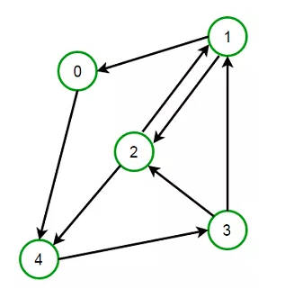

# Partner A

## Speaking of Code

What’s your favorite algorithm?

## Strongly Connected Graph

Given a directed graph, check to see whether it is strongly connected. A graph is said to be strongly connected if you can plot a path from each vertex to every other vertex.

### Example

The graph below is strongly connected since a path exists between all pairs of vertices:



## Solution

The naive approach to this problem is to perform a DFS or BFS starting from each node, build an array of connected nodes, and check to see whether the search visits each vertex in the graph. However, the time complexity of this approach is ```O(n(n + m))```, where ```n``` is the number of vertices and ```m``` is the number of edges in the graph. We can do better.

We can say that a graph is strongly connected if:

* DFS(G, v) visits all vertices in graph G, then there exists a path from v to every other vertex in G and
* There exists a path from every other vertex in G to v

How does this work? In order for our graph to be strongly connected, there must be a path from ```x --> y``` and from ```y --> x``` for each pair of vertices in the graph. It doesn't matter how many nodes are in between this pair - only that they connect. If both x and y are reachable from v, and if v is reachable from both x and y, then it follows that they are connected.

We will follow these steps to solve the problem:

* Choose any node ```n``` from our graph
* Perform a DFS starting from ```n``` and build a collection of connected nodes. If the collection does not include every node in the graph, return false
* Reverse the direction of all edges in the graph
* Run a second DFS from ```n``` and repeat step 2
* Return true if we have passed both searches

```ruby
require 'set'

class Vertex
  attr_accessor :value, :in_edges, :out_edges

  def initialize(value)
    @value, @in_edges, @out_edges = value, [], []
  end
end

class Edge
  attr_accessor :to_vertex, :from_vertex

  def initialize(from_vertex, to_vertex, cost = 1)
    self.from_vertex = from_vertex
    self.to_vertex = to_vertex

    to_vertex.in_edges << self
    from_vertex.out_edges << self
  end
end

class Graph
  attr_accessor :edges
  attr_reader :nodes

  def initialize
    @nodes = []
    @edges = []
  end

  def add(value)
    new_node = Vertex.new(value)
    @nodes << new_node
    new_node
  end

  def connect(from_node, to_node)
    @edges << Edge.new(from_node, to_node)
  end

  def is_strongly_connected?
    return false unless all_nodes_accessible?
    reverse_edges
    return false unless all_nodes_accessible?
    reverse_edges
    true
  end

  def all_nodes_accessible?
    visited = Set.new
    dfs(@nodes.first, visited)
    visited.length == @nodes.length
  end

  def dfs(node, visited)
    visited.add(node)

    node.out_edges.each do |edge|
      next_node = edge.to_vertex
      dfs(next_node, visited) unless visited.include?(next_node)
    end
  end

  def reverse_edges
    @edges.each do |edge|
      edge.from_vertex, edge.to_vertex = edge.to_vertex, edge.from_vertex
    end

    @nodes.each do |node|
      node.in_edges, node.out_edges = node.out_edges, node.in_edges
    end
  end
end
```

### Time Complexity

```O(n + m)```

## Credit

The question and solution were adapted from [this](http://www.techiedelight.com/check-given-graph-strongly-connected-not/) Techie Delight problem.
